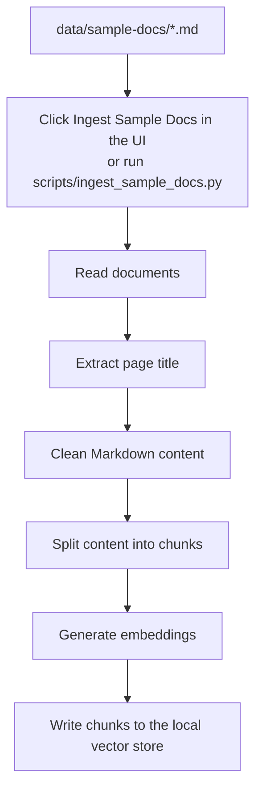

# Customer Support RAG Demo

A lightweight MVP for a customer-support internal knowledge assistant. The first version uses local sample Confluence-style documents and supports document ingestion, retrieval, draft support replies, internal evidence, and source links.

## Quick Start

```powershell
Copy-Item .env.example .env
python scripts\ingest_sample_docs.py
python app.py
```

Open http://127.0.0.1:8000

By default, `USE_MOCK_AI=true`, so the demo works without an OpenAI API key.

To use real models, set `OPENAI_API_KEY` in `.env` and change `USE_MOCK_AI=false`. This version calls the OpenAI REST API directly and does not require third-party Python packages.

## Vector Store

The default vector store backend is ChromaDB:

```text
VECTOR_STORE_BACKEND=chroma
VECTOR_STORE_DIR=.chroma
```

ChromaDB stores document chunks, embeddings, and metadata, then returns the most semantically similar chunks for each support question.

For a zero-dependency fallback, use:

```text
VECTOR_STORE_BACKEND=json
VECTOR_STORE_DIR=.vector-store
```

## Confluence Setup

The MVP can ingest pages from Confluence Cloud with a service account and API token.

Add these values to `.env`:

```text
CONFLUENCE_BASE_URL=https://your-company.atlassian.net/wiki
CONFLUENCE_EMAIL=service-account@your-company.com
CONFLUENCE_API_TOKEN=your-api-token
CONFLUENCE_SPACE_KEY=SUPPORT
CONFLUENCE_LIMIT=50
```

Optional:

```text
CONFLUENCE_CQL=type=page and space="SUPPORT" order by lastmodified desc
```

If `CONFLUENCE_CQL` is empty, the app builds a default CQL query from `CONFLUENCE_SPACE_KEY`.

To ingest Confluence content from the command line:

```powershell
python scripts\ingest_confluence.py
```

Or use the `Ingest Confluence` button in the web UI.

The Confluence importer uses Atlassian's REST API content search endpoint with CQL and expands `body.storage`, `version`, and `space` metadata.

## Publishing Drafts To Confluence

Local draft pages live in:

```text
data/confluence-drafts/
```

Preview the pages that would be created:

```powershell
python scripts\publish_confluence_drafts.py
```

Actually create the pages in the configured Confluence space and add the `support-kb` label:

```powershell
python scripts\publish_confluence_drafts.py --publish
```

The publish script creates new pages only. It does not update or overwrite existing Confluence pages.

## Tests

```powershell
python -m unittest
```

## Pipeline Code Map

The main ingestion and retrieval flow is split across these files:

- Document loading and cleanup: `src/ingest.py`
- Document chunking: `src/chunker.py`
- Embeddings and mock AI responses: `src/ai.py`
- Vector store upsert and search: `src/vector_store.py`
- Confluence Cloud sync: `src/confluence.py`
- Confluence draft publishing: `scripts/publish_confluence_drafts.py`
- Web API routes and the sample-ingest button handler: `src/main.py`

## Ingestion Flow



## Document Chunking

The ingestion pipeline automatically splits source documents into smaller chunks before writing them to the local vector store. This happens in `src/chunker.py`.

The MVP currently uses small chunks because the sample documents are short:

```python
max_words = 180
overlap_words = 30
```

These values make the demo easier to inspect and keep retrieval focused for short FAQ-style content.

Suggested starting point for real Confluence content:

```python
max_words = 450
overlap_words = 80
```
